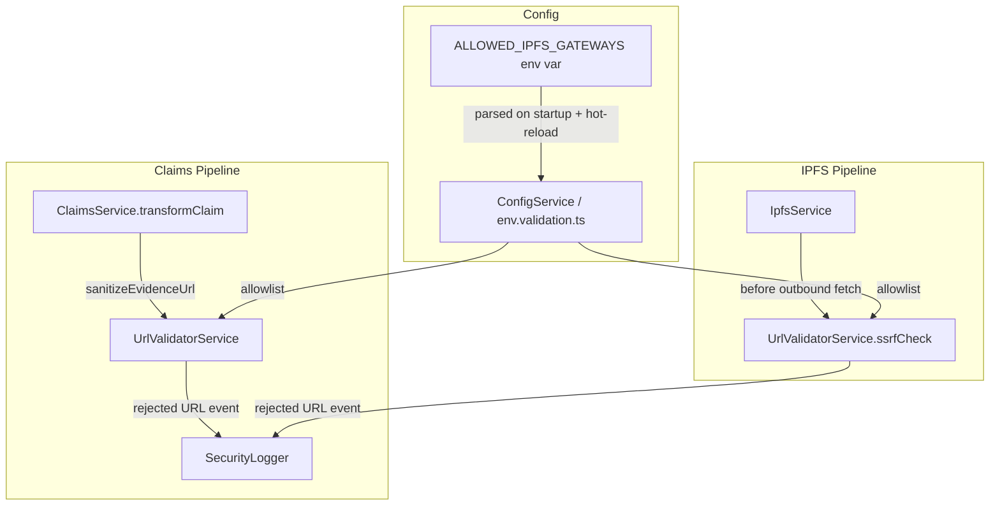

# Design Document: Claim Evidence URL Sanitization

## Overview

Evidence URLs stored on-chain in a claim's `imageUrls` field are untrusted input. Without
validation they could point to internal network addresses, enabling SSRF attacks through the
backend's IPFS fetch or preview endpoints. This feature introduces a dedicated `UrlValidatorService`
that enforces an environment-configurable gateway allowlist and SSRF prevention rules. All
evidence URLs are validated before being returned to clients or used in server-side fetches;
non-allowlisted URLs are replaced with a safe placeholder. Security events are logged in a
structured, PII-safe format.

## Architecture



The `UrlValidatorService` is the single source of truth for URL safety decisions. Both the
claims pipeline (response serialization) and the IPFS pipeline (server-side fetches) delegate
to it. The `SanitizationService` retains its existing responsibilities (XSS, wallet address,
IPFS hash sanitization) and delegates evidence URL validation to `UrlValidatorService`.

## Components and Interfaces

### UrlValidatorService

New injectable service at `backend/src/claims/url-validator.service.ts`.

```typescript
export const PLACEHOLDER_URL = 'redacted:non-allowlisted-url';

export type RejectionReason =
  | 'scheme-not-https'
  | 'hostname-not-allowlisted'
  | 'private-ip-range'
  | 'dns-resolution-failed'
  | 'malformed-url'
  | 'non-standard-port'
  | 'file-scheme';

export interface ValidationResult {
  safe: boolean;
  url: string;           // original URL if safe, PLACEHOLDER_URL if not
  reason?: RejectionReason;
}

@Injectable()
export class UrlValidatorService {
  /**
   * Validate an evidence URL for inclusion in an API response.
   * Checks: parseable, https scheme, port 443 (or absent), hostname in allowlist.
   * Does NOT perform DNS resolution (response-path only).
   */
  validateForResponse(url: string, claimId?: number): ValidationResult;

  /**
   * Validate a URL before a server-side fetch.
   * Performs all response-path checks PLUS DNS resolution and private-IP rejection.
   */
  validateForFetch(url: string, claimId?: number): Promise<ValidationResult>;

  /**
   * Reload the allowlist from ConfigService.
   * Called on a 60-second interval by the hot-reload scheduler.
   */
  reloadAllowlist(): void;
}
```

### SecurityLogger

Thin wrapper around NestJS `Logger` at `backend/src/claims/security-logger.service.ts`.

```typescript
export interface SanitizationEvent {
  redactedHash: string;   // SHA-256 hex of original URL
  claimId?: number;
  reason: RejectionReason;
  timestamp: string;      // ISO 8601 UTC
}

@Injectable()
export class SecurityLoggerService {
  logRejection(originalUrl: string, reason: RejectionReason, claimId?: number): void;
  // Emits warn-level log with SanitizationEvent fields only.
  // Tracks rejection counts per redactedHash; emits error-level if > 10 in 60 s.
}
```

### SanitizationService (modified)

`sanitizeEvidenceUrl` is updated to delegate to `UrlValidatorService.validateForResponse`.
The hardcoded `allowedDomains` set is removed from this class.

### ClaimsService (modified)

`transformClaim` calls `sanitization.sanitizeEvidenceUrl` (unchanged call site) which now
routes through `UrlValidatorService`. No direct changes to `ClaimsService` are required beyond
injecting `UrlValidatorService` into `SanitizationService`.

### IpfsService (modified)

Any method that constructs an outbound HTTP request from a URL derived from claim evidence
calls `urlValidator.validateForFetch(url)` before proceeding. If the result is not safe, the
method throws a `BadRequestException` with a generic message (no original URL in the message).

### Config / env.validation.ts (modified)

```typescript
ALLOWED_IPFS_GATEWAYS: Joi.string()
  .default('ipfs.io,cloudflare-ipfs.com,gateway.pinata.cloud,dweb.link,nftstorage.link')
  .description('Comma-separated list of permitted IPFS gateway hostnames')
  .custom((value: string, helpers) => {
    const entries = value.split(',').map(s => s.trim()).filter(Boolean);
    for (const entry of entries) {
      if (/\s|\//.test(entry)) {
        return helpers.error('any.invalid', {
          message: `ALLOWED_IPFS_GATEWAYS entry "${entry}" must not contain whitespace or path separators`,
        });
      }
    }
    const nodeEnv = helpers.state.ancestors[0]?.NODE_ENV ?? 'development';
    if (nodeEnv === 'production' && entries.length === 0) {
      return helpers.error('any.invalid', {
        message: 'ALLOWED_IPFS_GATEWAYS must not be empty in production',
      });
    }
    return value;
  }),
```

### Hot-Reload Scheduler

A NestJS `@Cron` or `setInterval`-based scheduler in `UrlValidatorService` calls
`reloadAllowlist()` every 60 seconds, re-reading `ALLOWED_IPFS_GATEWAYS` from `ConfigService`.
Because NestJS `ConfigService` reads from `process.env` at call time (when not using a cached
snapshot), updating the environment variable is sufficient for hot-reload in containerized
deployments that support live env injection.

## Data Models

### SanitizationEvent (log payload)

```typescript
{
  level: 'warn' | 'error',
  context: 'UrlValidatorService',
  redactedHash: string,   // SHA-256(originalUrl), hex-encoded, 64 chars
  claimId: number | null,
  reason: RejectionReason,
  timestamp: string       // ISO 8601 UTC, e.g. "2024-01-15T12:34:56.789Z"
}
```

The `originalUrl` field MUST NOT appear anywhere in this payload.

### Environment Variables (additions)

| Variable | Type | Default | Description |
|---|---|---|---|
| `ALLOWED_IPFS_GATEWAYS` | `string` | `ipfs.io,cloudflare-ipfs.com,gateway.pinata.cloud,dweb.link,nftstorage.link` | Comma-separated allowlisted IPFS gateway hostnames |

### Private IP Ranges (SSRF block list)

| Range | Description |
|---|---|
| `10.0.0.0/8` | RFC 1918 Class A |
| `172.16.0.0/12` | RFC 1918 Class B |
| `192.168.0.0/16` | RFC 1918 Class C |
| `127.0.0.0/8` | IPv4 loopback |
| `::1/128` | IPv6 loopback |
| `169.254.0.0/16` | IPv4 link-local |
| `fe80::/10` | IPv6 link-local |
| `fc00::/7` | IPv6 ULA |
| `0.0.0.0/8` | "This" network |

## Correctness Properties

*A property is a characteristic or behavior that should hold true across all valid executions
of a system — essentially, a formal statement about what the system should do. Properties serve
as the bridge between human-readable specifications and machine-verifiable correctness
guarantees.*

---

Property 1: Allowlisted https URLs pass validation unchanged

*For any* URL whose scheme is `https`, whose port is absent or 443, and whose hostname is in
the configured allowlist, `validateForResponse` SHALL return the original (or normalized) URL,
not the Placeholder_URL.

**Validates: Requirements 2.1, 2.2, 2.3**

---

Property 2: Non-allowlisted or unsafe URLs always yield the Placeholder_URL

*For any* URL that fails at least one of: parseable, `https` scheme, port 443/absent, hostname
in allowlist — `validateForResponse` SHALL return exactly `"redacted:non-allowlisted-url"`.
This covers malformed strings, `file://` URLs, `http://` URLs, non-standard ports, and
hostnames not in the allowlist.

**Validates: Requirements 2.2, 2.3, 2.4, 3.2, 3.3**

---

Property 3: Private-IP URLs are rejected by the fetch validator

*For any* URL that resolves (or whose literal hostname is) a Private_IP_Range address,
`validateForFetch` SHALL return the Placeholder_URL.

**Validates: Requirements 3.1**

---

Property 4: Security log entries never contain the original URL

*For any* URL rejected by `validateForResponse` or `validateForFetch`, the structured log
entry emitted by `SecurityLoggerService` SHALL contain the `redactedHash`, `reason`, and
`timestamp` fields, and SHALL NOT contain the original URL string in any field or message.

**Validates: Requirements 5.1, 5.2**

---

Property 5: ClaimsService response transformation replaces all unsafe URLs

*For any* claim record whose `imageUrls` array contains at least one non-allowlisted URL, the
`ClaimDetailResponseDto` produced by `transformClaim` SHALL contain the Placeholder_URL in
`evidence.gatewayUrl` and SHALL NOT contain the original non-allowlisted URL string anywhere
in the response object.

**Validates: Requirements 4.1, 4.2, 2.5**

---

Property 6: Allowlist hot-reload is reflected within one reload cycle

*For any* hostname added to `ALLOWED_IPFS_GATEWAYS` after service startup, after
`reloadAllowlist()` is called, `validateForResponse` SHALL accept URLs with that hostname.
Conversely, *for any* hostname removed from the allowlist, after `reloadAllowlist()` is called,
`validateForResponse` SHALL reject URLs with that hostname.

**Validates: Requirements 1.4**

---

Property 7: Env schema rejects invalid gateway entries

*For any* `ALLOWED_IPFS_GATEWAYS` string containing an entry with whitespace or a `/`
character, the Joi validation schema SHALL return a validation error and prevent application
startup.

**Validates: Requirements 1.3**

## Error Handling

| Scenario | Behavior |
|---|---|
| URL parse throws | Catch, return Placeholder_URL, log `malformed-url` |
| DNS resolution timeout | Return Placeholder_URL, log `dns-resolution-failed` |
| DNS resolution returns private IP | Return Placeholder_URL, log `private-ip-range` |
| `file://` scheme | Return Placeholder_URL, log `file-scheme` (no DNS call) |
| Non-`https` scheme | Return Placeholder_URL, log `scheme-not-https` |
| Non-standard port | Return Placeholder_URL, log `non-standard-port` |
| Hostname not in allowlist | Return Placeholder_URL, log `hostname-not-allowlisted` |
| Empty / null input | Return Placeholder_URL, log `malformed-url` |
| ConfigService unavailable at reload | Retain previous allowlist, log `warn` |

All error paths return the Placeholder_URL — they never throw to callers. This ensures the
claims API always returns HTTP 200 even when evidence URLs are invalid.

## Testing Strategy

### Dual Testing Approach

Both unit tests and property-based tests are required. Unit tests cover specific examples and
integration points; property-based tests verify universal correctness across the full input
space.

### Unit Tests

Location: `backend/src/__tests__/url-validator.service.test.ts` and
`backend/src/__tests__/security-logger.service.test.ts`

Cover:
- Each `RejectionReason` with a concrete example URL
- Default allowlist fallback when env var is absent
- Production startup rejection when allowlist is empty
- DNS mock returning private IP → rejection
- DNS mock failing → rejection
- Hot-reload: add hostname → accepted; remove hostname → rejected
- `ClaimsService.transformClaim` integration: mock `UrlValidatorService`, verify it is called
  for every URL in `imageUrls`
- HTTP 200 is returned even when all URLs are replaced with Placeholder_URL

### Property-Based Tests

Library: `fast-check` (already installed in backend).
Each property test runs a minimum of 100 iterations.

Location: `backend/src/__tests__/url-validator.property.test.ts`

| Test | Property | Tag |
|---|---|---|
| PBT-1 | Allowlisted https URLs pass | `Feature: claim-evidence-url-sanitization, Property 1` |
| PBT-2 | Non-allowlisted/unsafe URLs yield placeholder | `Feature: claim-evidence-url-sanitization, Property 2` |
| PBT-3 | Private-IP URLs rejected by fetch validator | `Feature: claim-evidence-url-sanitization, Property 3` |
| PBT-4 | Log entries never contain original URL | `Feature: claim-evidence-url-sanitization, Property 4` |
| PBT-5 | ClaimsService response replaces all unsafe URLs | `Feature: claim-evidence-url-sanitization, Property 5` |
| PBT-6 | Hot-reload reflected within one cycle | `Feature: claim-evidence-url-sanitization, Property 6` |
| PBT-7 | Env schema rejects invalid gateway entries | `Feature: claim-evidence-url-sanitization, Property 7` |

### fast-check Generators

```typescript
// Arbitrary for a valid allowlisted URL
const allowlistedUrl = (allowlist: string[]) =>
  fc.constantFrom(...allowlist).map(h => `https://${h}/ipfs/QmTest`);

// Arbitrary for a URL with a non-allowlisted hostname
const nonAllowlistedUrl = (allowlist: string[]) =>
  fc.domain().filter(d => !allowlist.includes(d))
    .map(d => `https://${d}/ipfs/QmTest`);

// Arbitrary for a private IPv4 address
const privateIpv4 = () =>
  fc.oneof(
    fc.ipV4().filter(ip => ip.startsWith('10.')),
    fc.ipV4().filter(ip => ip.startsWith('192.168.')),
    fc.constant('127.0.0.1'),
  );

// Arbitrary for a malformed / non-https URL string
const unsafeUrlString = () =>
  fc.oneof(
    fc.string(),                          // random garbage
    fc.webUrl().map(u => u.replace('https', 'http')),  // http scheme
    fc.constant('file:///etc/passwd'),    // file scheme
    fc.webUrl().map(u => u + ':8080'),    // non-standard port
  );
```

### Allowlist Update Process (inline documentation target)

The `UrlValidatorService` module file will include a JSDoc block describing:
1. How to add a new hostname to `ALLOWED_IPFS_GATEWAYS` in each environment's `.env` file or
   secrets manager.
2. The requirement that new hostnames must use `https` and must not resolve to private IPs.
3. How the 60-second hot-reload cycle picks up the change without a restart.
4. How to verify the change took effect by checking the `warn`-level log for the new hostname
   being accepted.
