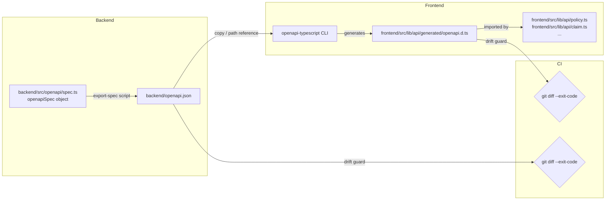

# Design Document: OpenAPI Client Codegen

## Overview

This design describes how to automate TypeScript type generation for the frontend from the backend's OpenAPI specification. The approach uses `openapi-typescript` (a zero-runtime, type-only codegen tool) to convert the static `openapiSpec` object in `backend/src/openapi/spec.ts` into a TypeScript declaration file consumed by the frontend. A drift guard in CI ensures the committed spec and generated types stay in sync with the source of truth.

The solution has three moving parts:
1. A **spec exporter** script that serialises `openapiSpec` to `backend/openapi.json`.
2. A **codegen step** in the frontend that reads that JSON and emits `frontend/src/lib/api/generated/openapi.d.ts`.
3. **CI drift guards** in both the backend (`unit-tests` job) and frontend jobs that fail when committed artefacts diverge from freshly generated ones.

---

## Architecture



**Data flow for `make generate-client`:**
1. `backend/scripts/export-spec.ts` imports `openapiSpec` and writes `backend/openapi.json`.
2. `frontend` codegen script invokes `openapi-typescript backend/openapi.json -o frontend/src/lib/api/generated/openapi.d.ts`.
3. The generated file is committed alongside source changes.

---

## Components and Interfaces

### 1. Spec Exporter (`backend/scripts/export-spec.ts`)

A minimal `ts-node` script:

```typescript
// backend/scripts/export-spec.ts
import { writeFileSync } from 'fs';
import { resolve } from 'path';
import { openapiSpec } from '../src/openapi/spec';

const outPath = resolve(__dirname, '..', 'openapi.json');
writeFileSync(outPath, JSON.stringify(openapiSpec, null, 2) + '\n', 'utf-8');
console.log(`Wrote ${outPath}`);
```

Registered in `backend/package.json`:
```json
"export-spec": "ts-node -P tsconfig.json scripts/export-spec.ts"
```

### 2. Codegen Script (`frontend/scripts/generate-client.sh` or npm script)

Uses the `openapi-typescript` CLI directly:

```bash
openapi-typescript ../backend/openapi.json \
  --output src/lib/api/generated/openapi.d.ts \
  --immutable
```

Registered in `frontend/package.json`:
```json
"generate-client": "openapi-typescript ../backend/openapi.json -o src/lib/api/generated/openapi.d.ts --immutable"
```

The `--immutable` flag marks all generated properties as `readonly`, preventing accidental mutation.

### 3. Generated File (`frontend/src/lib/api/generated/openapi.d.ts`)

`openapi-typescript` prepends its own header comment. We configure a custom header via the `--header` flag or a config file:

```
// !! DO NOT EDIT — auto-generated from backend/openapi.json
// !! Run `make generate-client` to regenerate after backend DTO changes.
```

### 4. Makefile Target (`generate-client`)

```makefile
generate-client:
	cd backend && npm run export-spec
	cd frontend && npm run generate-client
```

### 5. CI Drift Guards

**Backend drift guard** (added to `unit-tests` job):
```yaml
- name: Check OpenAPI spec is up to date
  run: |
    npm run export-spec
    if ! git diff --exit-code openapi.json; then
      echo "::error::backend/openapi.json is stale. Run 'make generate-client' locally and commit the updated file."
      exit 1
    fi
  working-directory: backend
```

**Frontend drift guard** (added to `frontend` job):
```yaml
- name: Copy OpenAPI spec and run codegen
  run: |
    npm run generate-client
    if ! git diff --exit-code src/lib/api/generated/openapi.d.ts; then
      echo "::error::Generated types are stale. Run 'make generate-client' locally and commit the updated file."
      exit 1
    fi
  working-directory: frontend
```

---

## Data Models

### OpenAPI → TypeScript type mapping

`openapi-typescript` handles the following cases required by the spec:

| OpenAPI construct | Generated TypeScript |
|---|---|
| `type: "string"` | `string` |
| `type: ["string", "null"]` | `string \| null` |
| `nullable: true` on a field | `T \| null` |
| `enum: ["a", "b"]` | `"a" \| "b"` |
| `oneOf: [SchemaA, SchemaB]` | `SchemaA \| SchemaB` |
| `anyOf: [SchemaA, SchemaB]` | `SchemaA \| SchemaB` |
| `discriminator.propertyName` | TypeScript discriminated union |
| `$ref: "#/components/schemas/Foo"` | Inlined or aliased type |

The generated file exports a root `paths` interface and a `components` namespace. Consumers use path-keyed types:

```typescript
import type { paths, components } from '@/lib/api/generated/openapi';

type PolicyDto = components['schemas']['PolicyDto'];
type ListPoliciesResponse = paths['/policies']['get']['responses']['200']['content']['application/json'];
```

### Existing API client migration

`frontend/src/lib/api/policy.ts` and `claim.ts` currently define their own interfaces. After codegen, these files should import from the generated types instead of re-declaring them. The manual interfaces are removed; the generated types become the single source of truth.

---

## Correctness Properties

*A property is a characteristic or behavior that should hold true across all valid executions of a system — essentially, a formal statement about what the system should do. Properties serve as the bridge between human-readable specifications and machine-verifiable correctness guarantees.*

### Property 1: Spec export round-trip

*For any* valid `openapiSpec` object, serialising it to JSON with `JSON.stringify` and then parsing it back with `JSON.parse` should produce a value deeply equal to the original.

**Validates: Requirements 1.1**

### Property 2: Nullable fields produce union types

*For any* OpenAPI schema property marked `nullable: true` or typed as `["T", "null"]`, the generated TypeScript type for that property should include `null` in its union.

**Validates: Requirements 2.2**

### Property 3: Drift guard detects any change

*For any* mutation to `openapiSpec` (adding, removing, or changing a field), re-running the export script should produce a `backend/openapi.json` that differs from the previously committed version, causing `git diff --exit-code` to return non-zero.

**Validates: Requirements 5.3**

### Property 4: Generated file always contains header warning

*For any* run of the codegen pipeline, the first lines of `frontend/src/lib/api/generated/openapi.d.ts` should contain the text `DO NOT EDIT` and the regeneration command.

**Validates: Requirements 3.1, 3.2, 3.3**

### Property 5: Codegen is idempotent

*For any* unchanged `backend/openapi.json`, running `npm run generate-client` twice in succession should produce byte-for-byte identical output both times.

**Validates: Requirements 2.1, 2.5**

---

## Error Handling

| Failure scenario | Behaviour |
|---|---|
| `export-spec` cannot write `openapi.json` | Script exits non-zero, prints error to stderr; `make generate-client` propagates failure |
| `openapi-typescript` receives malformed JSON | CLI exits non-zero with a parse error; codegen step fails |
| `backend/openapi.json` not present when frontend codegen runs | `openapi-typescript` exits non-zero; CI step fails with a clear message |
| `git diff` detects drift in CI | Step exits non-zero; GitHub Actions prints `::error::` annotation with remediation instructions |
| `make generate-client` partial failure (exporter succeeds, codegen fails) | `make` propagates the non-zero exit; developer sees which step failed |

---

## Testing Strategy

### Unit tests

- Test the `export-spec` script: mock `writeFileSync`, verify it is called with `JSON.stringify(openapiSpec, null, 2) + '\n'`.
- Test that the exported JSON parses back to an object deeply equal to `openapiSpec` (round-trip example).
- Test the drift-guard shell logic: given a diff, verify the exit code is non-zero.

### Property-based tests (fast-check, Jest)

Property tests live in `backend/src/__tests__/openapi-export.spec.ts`.

**Property 1 — Spec export round-trip**
```
// Feature: openapi-client-codegen, Property 1: Spec export round-trip
fc.assert(fc.property(fc.constant(openapiSpec), (spec) => {
  const json = JSON.stringify(spec, null, 2);
  expect(JSON.parse(json)).toEqual(spec);
}), { numRuns: 100 });
```

**Property 5 — Codegen idempotence**
Verified by running the codegen script twice in the CI pipeline and comparing outputs with `diff`.

### Integration checks (CI)

- Backend `unit-tests` job: drift guard step.
- Frontend job: codegen + drift guard step, followed by `npm run typecheck`.
- Both checks run on every PR and push to `main`.

### Manual verification

After running `make generate-client`, confirm:
1. `backend/openapi.json` is updated.
2. `frontend/src/lib/api/generated/openapi.d.ts` is updated.
3. `npm run typecheck` in `frontend/` passes.
4. `npm test` in `backend/` passes.
