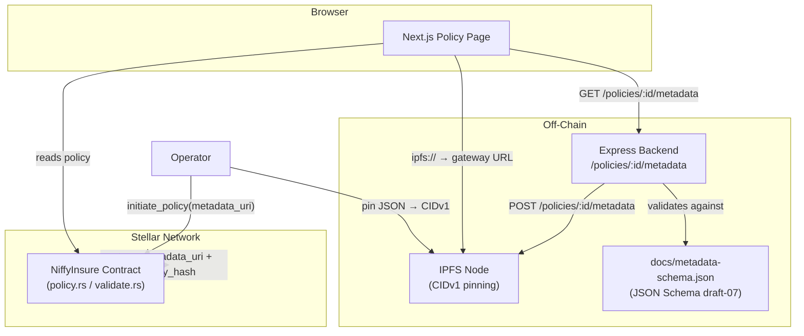

# Design Document: policy-metadata-uri

## Overview

The `policy-metadata-uri` feature extends the on-chain `Policy` struct with two optional fields:
`metadata_uri` (a compact URI or IPFS CIDv1 pointing to an off-chain JSON document) and
`metadata_integrity_hash` (an optional SHA-256 hex digest for tamper-evidence). The design keeps
chain storage minimal — the URI is capped at 128 bytes — while enabling rich off-chain content
(marketing copy, coverage tables, PDF links) to be linked from any policy.

The feature touches four layers:

1. **Soroban contract** (`types.rs`, `validate.rs`, `policy.rs`) — struct fields, constants,
   validation functions, event emission.
2. **Off-chain schema** (`docs/metadata-schema.json`, `docs/metadata-schema-changelog.md`,
   `docs/examples/metadata/`) — versioned JSON Schema and examples.
3. **Next.js frontend** — fetch, cache, integrity-check, and render metadata.
4. **TypeScript Express backend** — mirror endpoint, schema validation, compliance logging.

---

## Architecture



Key design decisions:

- **URI-only on-chain**: the contract stores only the URI string and an optional hash digest, never
  the JSON body. This bounds ledger rent to a fixed small allocation.
- **Validation before storage**: `check_metadata_uri` and `check_integrity_hash` run inside the
  contract before any `env.storage()` write, so invalid input always reverts.
- **Immutability preference**: CIDv1 URIs are content-addressed; HTTPS URLs are permitted but
  flagged as mutable in the runbook.
- **Schema versioning independent of contract**: the JSON schema lives in `docs/` and is versioned
  with semver; the contract does not parse the JSON body.

---

## Components and Interfaces

### 1. Soroban Contract — `types.rs`

Add two constants and two fields to `Policy`:

```rust
pub const METADATA_URI_MAX_LEN: u32 = 128;
pub const METADATA_INTEGRITY_HASH_LEN: u32 = 64; // lowercase hex SHA-256

// Inside Policy struct:
pub metadata_uri: Option<String>,
pub metadata_integrity_hash: Option<String>,
```

### 2. Soroban Contract — `validate.rs`

Two new public validation functions added to the existing `Error` enum and module:

```rust
// New error variants
MetadataUriTooLong,
MetadataUriEmpty,
MetadataIntegrityHashInvalid,

// New functions
pub fn check_metadata_uri(uri: &String) -> Result<(), Error>
pub fn check_integrity_hash(hash: &String) -> Result<(), Error>
```

`check_metadata_uri` rejects empty strings and strings whose byte length exceeds
`METADATA_URI_MAX_LEN`.

`check_integrity_hash` rejects strings whose length is not exactly 64 and strings containing
characters outside `[0-9a-f]`.

### 3. Soroban Contract — `policy.rs`

`initiate_policy` and `renew_policy` call both validators (when the respective `Option` is
`Some`) before writing to storage. `renew_policy` emits a `MetadataUriUpdated` event when
`metadata_uri` changes. `terminate_policy` leaves both fields unchanged.

Event topic/data layout:

```
topics: ["MetadataUriUpdated", policy_id: u32, holder: Address]
data:   new_metadata_uri: String
```

### 4. Off-Chain Schema — `docs/metadata-schema.json`

JSON Schema draft-07. Required fields: `schema_version`, `pii_free` (must be `true`),
`product_name`. Optional fields: `coverage_table_url`, `marketing_copy`, `pdf_links`, `custom`.

### 5. Express Backend — `backend/src/index.ts`

Two new endpoints:

| Method | Path | Purpose |
|--------|------|---------|
| `POST` | `/policies/:policyId/metadata` | Fetch URI, validate schema, store mirror |
| `GET`  | `/policies/:policyId/metadata` | Return mirrored JSON with cache headers |

The POST handler:
1. Fetches the document from `metadata_uri`.
2. Validates against `docs/metadata-schema.json` (using `ajv`).
3. If `metadata_integrity_hash` is present, computes SHA-256 and compares.
4. Rejects `pii_free: false` or absent with HTTP 422.
5. Persists and logs the operation.

### 6. Next.js Frontend — `frontend/src/app/`

A `useMetadata(policy)` hook:
1. Resolves `ipfs://` URIs to the configured gateway.
2. Fetches with a 5-second timeout.
3. Caches responses for 3 600 seconds.
4. Verifies SHA-256 against `metadata_integrity_hash` when present.
5. Returns `{ data, error, tamperWarning }` to the page component.

---

## Data Models

### Updated `Policy` struct (Rust / Soroban)

```rust
#[contracttype]
#[derive(Clone)]
pub struct Policy {
    pub holder: Address,
    pub policy_id: u32,
    pub policy_type: PolicyType,
    pub region: RegionTier,
    pub premium: i128,
    pub coverage: i128,
    pub is_active: bool,
    pub start_ledger: u32,
    pub end_ledger: u32,
    // ── new fields ──────────────────────────────────────────────────────
    /// Optional URI (IPFS CIDv1 or HTTPS) pointing to off-chain metadata JSON.
    /// Byte length must be in 1..=METADATA_URI_MAX_LEN when Some.
    pub metadata_uri: Option<String>,
    /// Optional lowercase hex SHA-256 digest of the canonical metadata JSON bytes.
    /// Must be exactly METADATA_INTEGRITY_HASH_LEN (64) hex chars when Some.
    pub metadata_integrity_hash: Option<String>,
}
```

### Metadata JSON document (TypeScript interface)

```typescript
interface MetadataJson {
  schema_version: string;       // semver, e.g. "1.0.0"
  pii_free: true;               // MUST be literal true
  product_name: string;         // non-empty
  coverage_table_url?: string;  // URI
  marketing_copy?: string;      // max 2000 chars
  pdf_links?: string[];         // max 10 URIs
  custom?: Record<string, unknown>;
}
```

### Backend in-memory mirror store (TypeScript)

```typescript
interface MirrorEntry {
  policyId: string;
  metadataUri: string;
  document: MetadataJson;
  fetchedAt: number;       // Unix ms
  validationOutcome: "ok" | "schema_fail" | "hash_mismatch";
}
```

---

## Correctness Properties


*A property is a characteristic or behavior that should hold true across all valid executions of a system — essentially, a formal statement about what the system should do. Properties serve as the bridge between human-readable specifications and machine-verifiable correctness guarantees.*

### Property 1: Oversized URI rejected

*For any* string whose byte length exceeds `METADATA_URI_MAX_LEN` (128), calling
`check_metadata_uri` on that string must return `Err(MetadataUriTooLong)`. This covers all
lengths from 129 up to arbitrarily large values, including the boundary case of exactly 129 bytes.

**Validates: Requirements 1.3, 8.2**

### Property 2: None metadata_uri round-trip

*For any* policy created with `metadata_uri = None`, reading the stored policy back must yield
`metadata_uri == None`. The absence of the field must survive a full write-read cycle.

**Validates: Requirements 1.5, 8.4**

### Property 3: Invalid URI leaves storage unchanged

*For any* call to `initiate_policy` or `renew_policy` that supplies an invalid `metadata_uri`
(empty or oversized), the contract must revert and the storage entry for that policy must remain
identical to its state before the call.

**Validates: Requirements 2.1, 2.2, 2.3**

### Property 4: MetadataUriUpdated event emitted on renew

*For any* `renew_policy` call that supplies a new non-`None` `metadata_uri` value, the contract
must emit exactly one `MetadataUriUpdated` event whose payload contains the correct `policy_id`,
`holder` address, and the new `metadata_uri` string.

**Validates: Requirements 2.4, 8.5**

### Property 5: terminate_policy preserves metadata_uri

*For any* policy that has a `metadata_uri` value (including `None`), calling `terminate_policy`
must leave `metadata_uri` and `metadata_integrity_hash` unchanged in the stored record.

**Validates: Requirements 2.5**

### Property 6: Integrity hash validator rejects invalid strings

*For any* string that is not exactly 64 lowercase hexadecimal characters (`[0-9a-f]`), calling
`check_integrity_hash` must return `Err(MetadataIntegrityHashInvalid)`. Conversely, *for any*
string that is exactly 64 lowercase hex characters, `check_integrity_hash` must return `Ok(())`.

**Validates: Requirements 3.4, 8.6**

### Property 7: Frontend tamper detection

*For any* fetched metadata document and any `metadata_integrity_hash` value that does not match
the SHA-256 digest of that document's bytes, the `useMetadata` hook must return
`tamperWarning = true` and must not expose the document content for rendering.

**Validates: Requirements 3.5**

### Property 8: Backend rejects documents failing schema or PII check

*For any* metadata document submitted to `POST /policies/:policyId/metadata` that either fails
JSON Schema validation or has `pii_free` set to anything other than `true`, the backend must
return HTTP 422 and must not persist the document.

**Validates: Requirements 4.2, 4.3, 7.2**

### Property 9: Backend rejects hash mismatch

*For any* metadata document whose SHA-256 digest does not match the `metadata_integrity_hash`
stored on the policy, the backend mirroring endpoint must return HTTP 409 and must not persist
the document.

**Validates: Requirements 7.4**

### Property 10: IPFS URI gateway resolution

*For any* `metadata_uri` string that begins with `ipfs://`, the `useMetadata` hook must resolve
it to a URL that begins with the configured IPFS gateway prefix before issuing the HTTP request.
No `ipfs://` URI should ever be passed directly to `fetch`.

**Validates: Requirements 6.3**

---

## Error Handling

### Contract layer

| Error | Trigger | Behaviour |
|-------|---------|-----------|
| `MetadataUriTooLong` | `metadata_uri` byte length > 128 | Transaction reverts; no storage write |
| `MetadataUriEmpty` | `metadata_uri` is `""` (zero bytes) | Transaction reverts; no storage write |
| `MetadataIntegrityHashInvalid` | hash length ≠ 64 or non-hex chars | Transaction reverts; no storage write |

All existing errors (`ZeroCoverage`, `PolicyExpired`, etc.) are unaffected.

### Backend layer

| Scenario | HTTP status | Body |
|----------|-------------|------|
| Schema validation failure | 422 | `{ "error": "schema_validation_failed", "details": [...] }` |
| `pii_free` not `true` | 422 | `{ "error": "pii_check_failed" }` |
| Hash mismatch | 409 | `{ "error": "integrity_hash_mismatch" }` |
| Upstream fetch failure | 502 | `{ "error": "upstream_fetch_failed" }` |

### Frontend layer

| Scenario | UI response |
|----------|-------------|
| Fetch timeout (> 5 s) | Timeout notice; page renders without metadata |
| Non-2xx response (after ≤ 2 retries) | Error notice; no metadata rendered |
| Unrecognised `schema_version` | Unsupported-schema notice |
| SHA-256 mismatch | Tamper-warning banner; metadata content suppressed |

---

## Testing Strategy

### Dual testing approach

Both unit tests and property-based tests are required. Unit tests cover specific examples,
boundary conditions, and integration points. Property-based tests verify universal invariants
across randomly generated inputs.

### Contract — Rust tests (`tests/types_validate.rs`, `tests/integration.rs`)

**Unit / example tests** (specific scenarios):
- `METADATA_URI_MAX_LEN` constant equals 128.
- `Policy` constructed without `metadata_uri` has `metadata_uri == None`.
- `initiate_policy` with `metadata_uri = None` succeeds and stores `None`.
- `initiate_policy` with exactly 128-byte URI succeeds (boundary).
- `initiate_policy` with 129-byte URI returns `MetadataUriTooLong` (boundary).
- `initiate_policy` with empty URI returns `MetadataUriEmpty`.
- `renew_policy` with changed URI emits `MetadataUriUpdated` event.
- `terminate_policy` leaves `metadata_uri` unchanged.
- `check_integrity_hash` accepts a valid 64-char lowercase hex string.
- `check_integrity_hash` rejects a 63-char string, a 65-char string, and a string with uppercase.

**Property-based tests** using [`proptest`](https://github.com/proptest-rs/proptest) (minimum 100
iterations each):

```
// Feature: policy-metadata-uri, Property 1: Oversized URI rejected
proptest! { fn prop_oversized_uri_rejected(s in any_string_longer_than(128)) { ... } }

// Feature: policy-metadata-uri, Property 6: Integrity hash validator rejects invalid strings
proptest! { fn prop_invalid_hash_rejected(s in any_non_64hex_string()) { ... } }
proptest! { fn prop_valid_hash_accepted(s in valid_64hex_string()) { ... } }
```

### Backend — TypeScript tests (Jest)

**Unit tests**:
- `POST /policies/:id/metadata` with a valid document returns 200 and persists.
- `POST` with `pii_free: false` returns 422.
- `POST` with missing required field returns 422.
- `POST` with hash mismatch returns 409.
- `GET /policies/:id/metadata` returns mirrored document with `Cache-Control: max-age=3600`.

**Property-based tests** using [`fast-check`](https://github.com/dubzzz/fast-check) (minimum 100
iterations each):

```typescript
// Feature: policy-metadata-uri, Property 8: Backend rejects documents failing schema or PII check
fc.assert(fc.asyncProperty(invalidDocumentArb, async (doc) => {
  const res = await request(app).post('/policies/1/metadata').send({ doc });
  expect(res.status).toBe(422);
}), { numRuns: 100 });

// Feature: policy-metadata-uri, Property 9: Backend rejects hash mismatch
fc.assert(fc.asyncProperty(docAndMismatchedHashArb, async ({ doc, hash }) => {
  const res = await request(app).post('/policies/1/metadata').send({ doc, hash });
  expect(res.status).toBe(409);
}), { numRuns: 100 });
```

### Frontend — TypeScript tests (Jest + React Testing Library)

**Unit / example tests**:
- `useMetadata` with `metadata_uri = null` returns `{ data: null, error: null }`.
- `useMetadata` with `ipfs://bafyrei…` resolves to gateway URL before fetching.
- `useMetadata` with a slow mock fetch (> 5 s) returns timeout error.
- `useMetadata` with a non-2xx response retries at most 2 times.
- `useMetadata` with mismatched hash returns `tamperWarning = true`.
- `useMetadata` with unrecognised `schema_version` returns unsupported-schema error.

**Property-based tests** using `fast-check` (minimum 100 iterations each):

```typescript
// Feature: policy-metadata-uri, Property 7: Frontend tamper detection
fc.assert(fc.asyncProperty(docAndMismatchedHashArb, async ({ doc, hash }) => {
  const { result } = renderHook(() => useMetadata({ metadata_uri: 'ipfs://x', metadata_integrity_hash: hash }));
  // ... mock fetch returning doc bytes
  expect(result.current.tamperWarning).toBe(true);
}), { numRuns: 100 });

// Feature: policy-metadata-uri, Property 10: IPFS URI gateway resolution
fc.assert(fc.property(fc.string().map(cid => `ipfs://${cid}`), (uri) => {
  const resolved = resolveMetadataUri(uri, GATEWAY);
  return resolved.startsWith(GATEWAY);
}), { numRuns: 100 });
```

### Schema validation tests

- Load `docs/metadata-schema.json` and assert it is valid JSON Schema draft-07.
- Load each file under `docs/examples/metadata/` and assert it passes the schema.
- Assert that a document with `pii_free: false` fails the schema.
- Assert that a document missing `product_name` fails the schema.
