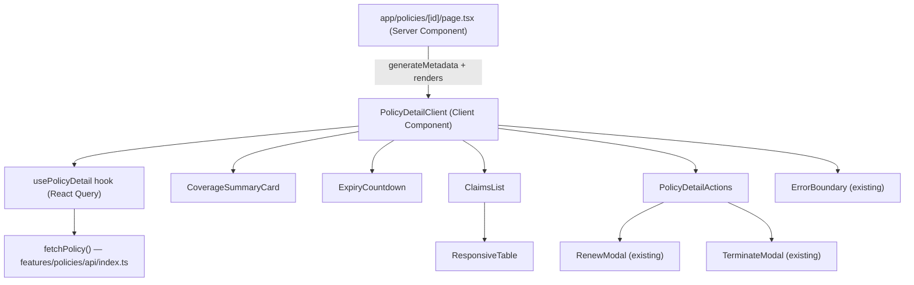

# Design Document: Policy Detail Page & Responsive Table

## Overview

This feature adds a shareable policy detail page at `app/policies/[id]/page.tsx` and a reusable `ResponsiveTable` component. The detail page renders coverage data, expiry countdown, linked claims, and contextual renewal/termination CTAs. The `ResponsiveTable` wraps any tabular data in a horizontally-scrollable container with a sticky first column, solving the narrow-viewport overflow problem without page-level layout changes.

The page is public-first: unauthenticated visitors can view all coverage data. Wallet-gated actions (renew, terminate) are conditionally rendered based on `useWallet()` connection state and on-chain rules.

---

## Architecture

The feature follows the existing Next.js 15 App Router pattern: a Server Component at the route level handles metadata generation, while a Client Component subtree handles interactive state (React Query, modals, wallet).



**Data flow:**
1. Server Component reads `params.id` and renders `<PolicyDetailClient policyId={id} />`.
2. `PolicyDetailClient` calls `usePolicyDetail(policyId)` which uses `useQuery(['policy', policyId], ...)`.
3. On modal success, `queryClient.invalidateQueries({ queryKey: ['policy', policyId] })` triggers a background refetch.
4. Toast notifications use the existing Radix UI toast infrastructure.

**Route:** `app/policies/[id]/page.tsx` — the `[id]` segment is the numeric `policy_id`. The `holder` address is read from the connected wallet (`useWallet().address`) or from the policy response itself after the first fetch. Since the API endpoint is `GET /api/policies/:holder/:policy_id`, the holder must be known before fetching. The design resolves this by requiring the holder to be passed as a query parameter (`?holder=...`) or derived from the URL. See Components section for the chosen approach.

**Holder resolution strategy:** The list page links to `/policies/[id]?holder=<address>`. The detail page reads `searchParams.holder` in the Server Component and passes it to the client. If absent and the user is authenticated, the client falls back to `useWallet().address`. If neither is available, the page renders an error prompting the user to connect their wallet or use a full link.

---

## Components and Interfaces

### 1. `features/policies/api/index.ts` — `fetchPolicy`

New export added to the existing API module:

```typescript
export class PolicyFetchError extends Error {
  constructor(public status: number, public code: string, message: string) {
    super(message);
    this.name = 'PolicyFetchError';
  }
}

export async function fetchPolicy(
  holder: string,
  policyId: number,
  signal?: AbortSignal,
): Promise<PolicyDto>
```

- Calls `GET /api/policies/:holder/:policyId`
- Validates response with `PolicyDtoSchema.safeParse`
- Throws `PolicyFetchError` with the HTTP status code on non-2xx responses (enables 404 vs. other error distinction in the UI)

---

### 2. `features/policies/hooks/usePolicyDetail.ts`

```typescript
export function usePolicyDetail(holder: string | null, policyId: number | null): {
  policy: PolicyDto | undefined;
  isLoading: boolean;
  isError: boolean;
  error: PolicyFetchError | Error | null;
  refetch: () => void;
}
```

- Uses `useQuery` from `@tanstack/react-query`
- Cache key: `['policy', holder, policyId]`
- `enabled`: only when both `holder` and `policyId` are non-null
- `staleTime`: 30 seconds (balances freshness with indexer lag)
- `retry`: 2 retries, skipping retry on 404 (`error.status === 404`)

---

### 3. `app/policies/[id]/page.tsx` — Server Component

```typescript
export async function generateMetadata({ params, searchParams }): Promise<Metadata>
export default function PolicyDetailPage({ params, searchParams })
```

- `generateMetadata` returns `{ title: 'Policy #<id> — <type>', description: '...' }` — uses a lightweight server-side fetch or falls back to a generic title if the fetch fails (metadata errors must not break the page render).
- Renders `<PolicyDetailClient policyId={params.id} holder={searchParams.holder} />`
- Validates `params.id` is a positive integer; renders an inline error if not (no API call made).

---

### 4. `features/policies/components/PolicyDetailClient.tsx` — Client Component

The root client component for the detail page. Owns modal state and query invalidation.

```typescript
interface Props {
  policyId: string;   // raw string from URL params, validated here
  holder: string | null;
}
```

- Parses and validates `policyId` to a positive integer; renders `<InvalidIdError />` if invalid.
- Resolves `holder` from prop or `useWallet().address`.
- Calls `usePolicyDetail(resolvedHolder, parsedId)`.
- Renders `<ErrorBoundary area="Policy Detail">` wrapping the content.
- Handles `isLoading` → skeleton layout, `error.status === 404` → not-found message, other errors → error message + retry button.
- Manages `renewModalOpen` and `terminateModalOpen` state.
- On modal `onSubmitted`: calls `queryClient.invalidateQueries({ queryKey: ['policy', holder, policyId] })` and fires a toast.

---

### 5. `features/policies/components/CoverageSummaryCard.tsx`

```typescript
interface Props {
  policy: PolicyDto;
  connectedAddress: string | null;
}
```

Displays: holder, policy type, region, coverage amount (via `formatXlm`), premium amount (via `formatXlm`), currency, active status badge, and beneficiary (or "Not set — payouts go to holder" when null).

Shows a phishing-risk warning banner when `connectedAddress` is non-null and differs from `policy.beneficiary`.

---

### 6. `features/policies/components/ExpiryCountdown.tsx`

```typescript
interface Props {
  expiryCountdown: PolicyDto['expiry_countdown'];
}
```

- Computes `totalSeconds = ledgers_remaining * avg_ledger_close_seconds`
- Formats as "X days Y hours" (or "X hours Y minutes", etc.) using integer division
- Displays raw `ledgers_remaining` alongside the human-readable estimate
- Always renders the indexer-lag disclaimer: "ⓘ Values may lag on-chain state by up to 15 s"
- When `ledgers_remaining <= 0`: renders "Policy expired" instead of a countdown

---

### 7. `features/policies/components/ClaimsList.tsx`

```typescript
interface Props {
  claims: ClaimSummaryDto[];
  isLoading?: boolean;
}
```

Renders a `ResponsiveTable` with columns: Claim ID (sticky, links to `claim._link`), Amount (XLM), Status (badge), Approve Votes, Reject Votes.

Empty state: "No claims filed for this policy."

Status badge color mapping:
- `Processing` → yellow (`bg-yellow-100 text-yellow-800`)
- `Approved` → green (`bg-green-100 text-green-800`)
- `Rejected` → red (`bg-red-100 text-red-800`)

---

### 8. `features/policies/components/PolicyDetailActions.tsx`

```typescript
interface Props {
  policy: PolicyDto;
  onRenew: () => void;
  onTerminate: () => void;
  connected: boolean;
}
```

Renders renewal and termination CTAs. Reuses the same `RENEWAL_WINDOW_LEDGERS = 518_400` constant and gate logic from `PolicyItem.tsx`. When `connected` is false, neither button is rendered. Disabled buttons include a `title` tooltip explaining why.

---

### 9. `components/ui/responsive-table.tsx`

The core new reusable component.

```typescript
interface ResponsiveTableProps<T> {
  columns: Column<T>[];           // reuses Column<T> from data-table.tsx
  data: T[];
  caption?: string;               // visually hidden, announced by screen readers
  isLoading?: boolean;            // renders skeleton rows + aria-busy="true"
  emptyMessage?: string;          // default: "No data available"
  stickyColumnWidth?: string;     // default: "auto"; sets min-width on first column
  showScrollbar?: boolean;        // default: true
  scrollStep?: number;            // default: 120 (px per ArrowLeft/ArrowRight keypress)
  'aria-label'?: string;          // applied to the scroll container div
  className?: string;
}
```

**Scroll container:** `<div role="region" tabIndex={0} aria-label={...} style={{ overflowX: 'auto', maxWidth: '100%' }}>` with `onKeyDown` handler for ArrowLeft/ArrowRight.

**Sticky column:** First `<th>` and first `<td>` in each row get `className="sticky left-0 bg-background z-10"` (Tailwind). The `bg-background` CSS variable matches the page background, preventing bleed-through.

**Scrollbar visibility:** When `showScrollbar` is true, the scroll container gets a CSS class that applies `scrollbar-width: thin` (Firefox) and `::-webkit-scrollbar { height: 6px }` styles via a global CSS utility class `scrollbar-thin`.

**Loading state:** Renders 3 skeleton rows (matching `DataTable` pattern of 5 rows, reduced to 3 for detail views) with `aria-busy="true"` on the `<table>`.

---

## Data Models

No new data models are introduced. The feature consumes existing types:

```typescript
// Already defined in features/policies/api/index.ts
type PolicyDto = {
  holder: string;
  policy_id: number;
  policy_type: 'Auto' | 'Health' | 'Property';
  region: 'Low' | 'Medium' | 'High';
  is_active: boolean;
  coverage_summary: {
    coverage_amount: string;  // stroops as string
    premium_amount: string;   // stroops as string
    currency: 'XLM';
    decimals: 7;
  };
  expiry_countdown: {
    start_ledger: number;
    end_ledger: number;
    ledgers_remaining: number;
    avg_ledger_close_seconds: 5;
  };
  claims: ClaimSummaryDto[];
  _link: string;
};

type ClaimSummaryDto = {
  claim_id: number;
  amount: string;           // stroops as string
  status: 'Processing' | 'Approved' | 'Rejected';
  approve_votes: number;
  reject_votes: number;
  voting_deadline_ledger?: number;
  _link: string;
};
```

New error type added to the API module:

```typescript
class PolicyFetchError extends Error {
  status: number;   // HTTP status code (404, 500, etc.)
  code: string;     // machine-readable error code from API
}
```

---

## Correctness Properties

*A property is a characteristic or behavior that should hold true across all valid executions of a system — essentially, a formal statement about what the system should do. Properties serve as the bridge between human-readable specifications and machine-verifiable correctness guarantees.*

### Property 1: Invalid policy ID prevents fetch

*For any* string that is not a positive integer (empty string, negative number, float, non-numeric text), the detail page component should render an error message and make zero calls to `fetchPolicy`.

**Validates: Requirements 1.2**

---

### Property 2: Page metadata contains policy identity

*For any* `PolicyDto`, the metadata title and description generated by `generateMetadata` should contain both the `policy_id` and `policy_type` as substrings.

**Validates: Requirements 1.4**

---

### Property 3: Coverage card renders all required fields

*For any* `PolicyDto`, the rendered `CoverageSummaryCard` output should contain the holder address, policy type, region, formatted coverage amount, formatted premium amount, currency, and active/inactive status label.

**Validates: Requirements 2.1, 2.3**

---

### Property 4: Beneficiary mismatch triggers warning

*For any* `PolicyDto` where `beneficiary` is non-null and any connected wallet address that differs from `beneficiary`, the `CoverageSummaryCard` should render a warning element containing a phishing risk notice.

**Validates: Requirements 2.2**

---

### Property 5: Expiry countdown displays both raw and computed values

*For any* `expiry_countdown` with `ledgers_remaining > 0`, the rendered `ExpiryCountdown` should contain the raw `ledgers_remaining` number as a string and a human-readable duration derived from `ledgers_remaining * avg_ledger_close_seconds`.

**Validates: Requirements 3.1, 3.2**

---

### Property 6: Expired policy shows "Policy expired"

*For any* `expiry_countdown` where `ledgers_remaining` is 0 or any negative integer, the rendered `ExpiryCountdown` should display "Policy expired" and should not display a positive duration.

**Validates: Requirements 3.4**

---

### Property 7: Claims list renders one row per claim

*For any* non-empty array of `ClaimSummaryDto`, the rendered `ClaimsList` should contain exactly that many data rows, each row containing the claim's `claim_id`, formatted `amount`, `status` text, `approve_votes`, and `reject_votes`.

**Validates: Requirements 4.1**

---

### Property 8: Renewal CTA enabled state matches renewal window

*For any* `PolicyDto` and authenticated user, the Renewal CTA should be enabled if and only if `ledgers_remaining <= 518_400` and `is_active` is true and `ledgers_remaining > 0`; otherwise it should be disabled with a tooltip.

**Validates: Requirements 5.1, 5.2**

---

### Property 9: Termination CTA enabled state matches is_active

*For any* `PolicyDto` and authenticated user, the Termination CTA should be enabled if and only if `policy.is_active` is true; when `is_active` is false the button should be disabled with a tooltip containing "already inactive".

**Validates: Requirements 6.1, 6.2**

---

### Property 10: Unauthenticated users see no action CTAs

*For any* `PolicyDto` and unauthenticated state (`connected = false`), neither the Renewal CTA nor the Termination CTA should be present in the rendered output.

**Validates: Requirements 5.3, 6.3**

---

### Property 11: API error renders error message and retry button

*For any* non-404 HTTP error response from `fetchPolicy`, the `PolicyDetailClient` should render the API error message (or a generic fallback) and a button labeled "Retry".

**Validates: Requirements 7.2**

---

### Property 12: ResponsiveTable renders correct table structure

*For any* `columns` array of length N and `data` array of length M, the rendered `ResponsiveTable` should contain exactly M data rows each with exactly N cells, all wrapped in a `<table>` with `<thead>` and `<tbody>`.

**Validates: Requirements 8.1, 8.5**

---

### Property 13: Scroll container has correct overflow and width constraints

*For any* `ResponsiveTable`, the scroll container element should have `overflow-x: auto` (or the equivalent Tailwind class `overflow-x-auto`) and `max-width: 100%`.

**Validates: Requirements 8.2, 10.1**

---

### Property 14: First column is sticky

*For any* `ResponsiveTable` with at least one column, the first `<th>` and the first `<td>` in every data row should have CSS `position: sticky` and `left: 0`.

**Validates: Requirements 8.3**

---

### Property 15: All header cells have scope="col"

*For any* `columns` array, every `<th>` rendered in the header row should have `scope="col"`.

**Validates: Requirements 9.1**

---

### Property 16: Arrow key scrolling changes scroll position

*For any* `ResponsiveTable` scroll container with focus and a non-zero `scrollStep`, pressing ArrowRight should increase `scrollLeft` by `scrollStep` and pressing ArrowLeft should decrease `scrollLeft` by `scrollStep` (clamped to valid range).

**Validates: Requirements 9.2**

---

### Property 17: Scroll container has tabIndex and aria-label

*For any* `ResponsiveTable` with an `aria-label` prop, the scroll container `<div>` should have `tabIndex={0}` and the provided `aria-label` value.

**Validates: Requirements 9.3**

---

### Property 18: Caption renders when provided

*For any* non-empty `caption` string prop, the rendered `ResponsiveTable` should contain a `<caption>` element with that text and a visually-hidden CSS class.

**Validates: Requirements 9.4**

---

### Property 19: Loading state renders skeletons and aria-busy

*For any* `ResponsiveTable` with `isLoading={true}`, the `<table>` element should have `aria-busy="true"` and the body should contain skeleton placeholder elements instead of data rows.

**Validates: Requirements 9.5**

---

### Property 20: stickyColumnWidth prop sets first column width

*For any* non-"auto" `stickyColumnWidth` value, the first `<th>` and first `<td>` in the rendered table should have that value applied as a `min-width` or `width` style.

**Validates: Requirements 10.3**

---

## Error Handling

| Scenario | Behavior |
|---|---|
| `params.id` is not a positive integer | Inline error, no API call |
| `holder` not resolvable (no query param, no wallet) | Prompt to connect wallet or use a full policy link |
| API returns 404 | "Policy not found" message + link to `/policies` |
| API returns non-404 error | Error message from API (or generic fallback) + "Retry" button |
| Network unavailable | "Unable to connect" message + "Retry" button |
| Render error in child component | `ErrorBoundary` catches it, shows fallback + "Try again" |
| `generateMetadata` fetch fails | Falls back to generic title; does not break page render |
| Modal transaction fails | Modal handles internally (existing `RenewModal`/`TerminateModal` error states) |

**Retry behavior:** The "Retry" button calls `refetch()` from `usePolicyDetail`, which re-triggers the React Query fetch. The `ErrorBoundary` "Try again" button calls `this.reset()` to clear the error state.

**Indexer lag:** All time-sensitive displays (expiry countdown, claim status) include the disclaimer "ⓘ Values may lag on-chain state by up to 15 s". After a successful modal submission, the UI shows a toast and the cache is invalidated, but the user is not expected to see instant updates.

---

## Testing Strategy

### Unit Tests (Jest + React Testing Library)

Focus on specific examples, edge cases, and integration points:

- `fetchPolicy` — 404 throws `PolicyFetchError` with `status: 404`; non-2xx throws with correct status; valid response parses correctly
- `usePolicyDetail` — does not call `fetchPolicy` when `holder` or `policyId` is null; calls with correct args when both present
- `ExpiryCountdown` — renders "Policy expired" when `ledgers_remaining <= 0`; renders indexer-lag disclaimer
- `ClaimsList` — renders empty-state message when `claims` is `[]`
- `PolicyDetailClient` — renders "Policy not found" on 404; renders retry button on non-404 error; renders skeleton during loading
- `CoverageSummaryCard` — renders "Not set — payouts go to holder" when beneficiary is null
- Cache invalidation — after `onSubmitted` callback, `queryClient.invalidateQueries` is called with the correct key

### Property-Based Tests (fast-check, minimum 100 iterations each)

The project already has `fast-check` in devDependencies. Each property test must be tagged with a comment in the format:
`// Feature: policy-detail-and-responsive-table, Property <N>: <property_text>`

| Property | Test description |
|---|---|
| P1 | Generate arbitrary non-positive-integer strings; assert `fetchPolicy` call count is 0 and error element is present |
| P2 | Generate random `policy_id` (positive int) and `policy_type`; assert both appear in metadata output |
| P3 | Generate random `PolicyDto`; render `CoverageSummaryCard`; assert all required fields present in output |
| P4 | Generate random `PolicyDto` with non-null beneficiary and a different wallet address; assert warning element present |
| P5 | Generate random `ledgers_remaining > 0`; render `ExpiryCountdown`; assert raw value and computed duration both present |
| P6 | Generate `ledgers_remaining` from `{0, negative integers}`; assert "Policy expired" present, no positive duration |
| P7 | Generate random `ClaimSummaryDto[]` of length 1–20; render `ClaimsList`; assert row count equals array length |
| P8 | Generate random `PolicyDto` with varying `ledgers_remaining` and `is_active`; assert Renewal CTA enabled iff within window |
| P9 | Generate random `PolicyDto` with varying `is_active`; assert Termination CTA enabled iff `is_active` |
| P10 | Generate random `PolicyDto`; render with `connected=false`; assert neither CTA present |
| P11 | Generate random non-404 HTTP error codes and messages; assert error message and retry button present |
| P12 | Generate random `columns` (1–10) and `data` (0–50 rows); assert row count and cell count correct |
| P13 | Generate any valid `ResponsiveTable` props; assert scroll container has `overflow-x-auto` and `max-w-full` |
| P14 | Generate random `columns` and `data`; assert first th and all first tds have sticky + left-0 classes |
| P15 | Generate random `columns`; assert every `<th>` has `scope="col"` |
| P16 | Generate random `scrollStep` (1–500); simulate ArrowRight/ArrowLeft; assert `scrollLeft` changes by `scrollStep` |
| P17 | Generate random `aria-label` strings; assert scroll container has `tabIndex=0` and the label |
| P18 | Generate random non-empty caption strings; assert `<caption>` element present with that text |
| P19 | Render with `isLoading=true`; assert `aria-busy="true"` on table and skeleton elements present |
| P20 | Generate random CSS width strings; assert first column has that width applied |

### Accessibility Tests (Playwright + axe-core)

The project has `@axe-core/playwright` in devDependencies. Add E2E tests that:
- Run `axe` on the policy detail page at 375 px, 768 px, and 1280 px viewports
- Verify no WCAG 2.1 AA violations on the `ResponsiveTable` component in isolation
- Verify keyboard navigation: Tab to scroll container, ArrowRight scrolls, ArrowLeft scrolls back
